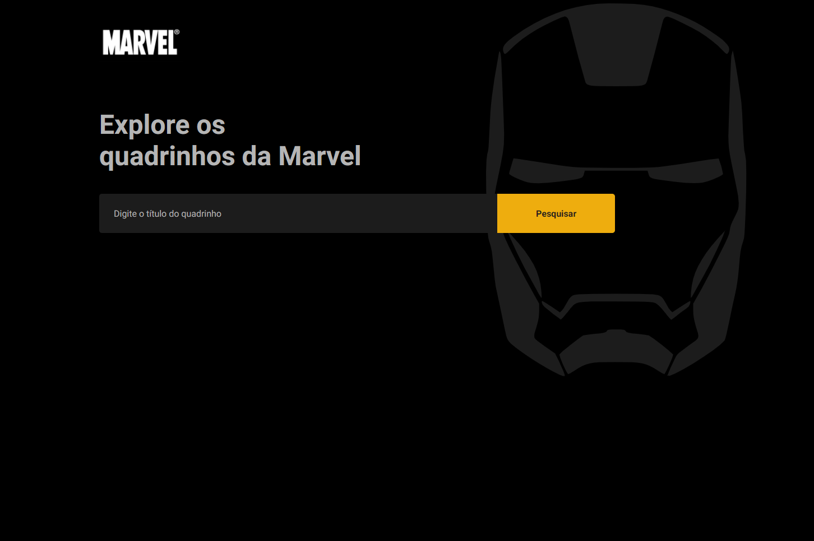

<p align="center" >
  Marvel App
</p>

<h1 align="center">
    
</h1>

<p align="center">
  <a href="#-tecnologias">Tecnologias</a>&nbsp;&nbsp;&nbsp;|&nbsp;&nbsp;&nbsp;
  <a href="#-executando-o-projeto">Executando o projeto</a>&nbsp;&nbsp;&nbsp;|&nbsp;&nbsp;&nbsp;
  <a href="#-testes">Testes</a>&nbsp;&nbsp;&nbsp;|&nbsp;&nbsp;&nbsp;
  <a href="#-para-envio-dos-quadrinhos-via-e-mail">Variáveis de ambiente</a>&nbsp;&nbsp;&nbsp;|&nbsp;&nbsp;&nbsp;
</p>

O projeto tem como objetivo pesquisar os quadrinhos da Marvel identificando o seu respectivo título e selecionando-os para envio por e-mail na tela principal. É possível ver os detalhes de cada quadrinho (descrição, número de páginas e imagem) .

## 🧪 Tecnologias

- ReactJS
- Typescript
- Jest
- Axios
- Styled Component
- Eslint
- Prettier
- Mailjs

## 🚀 Executando o projeto

```bash
# Install the dependencies
$ yarn

# Start the project
$ yarn start
```

## Testes

```bash
# Run tests
$ yarn test
```

## Para envio dos quadrinhos via e-mail

Para o serviço de e-mail, foi utilizada a biblioteca `emailjs-com`. Com isso a utilização pede que seja informado algumas variáveis de ambiente para simular o envio. Elas estão presentes no arquivo `.env.example` e podem ser preenchidas com os dados da conta e do serviço criados no seguinte endereço: [Mailjs](https://www.emailjs.com/).

